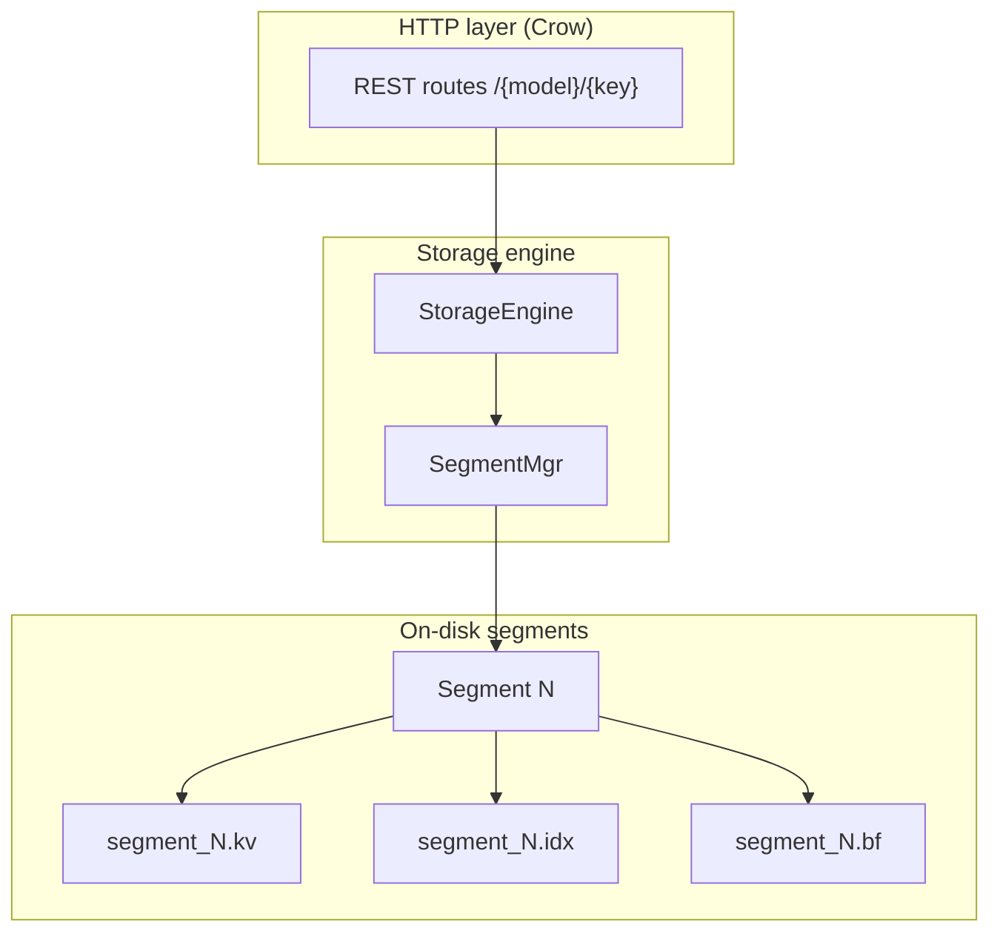

# ByterStore Architecture

ByterStore is a segmented, append-only key–value store with an HTTP REST front end. Each **model** (e.g. `users`, `products`) is a directory on disk; keys are hashed and indexed for fast lookup.

## Layer overview



| Layer | Component | Responsibility |
|-------|-----------|----------------|
| HTTP | `main.cpp` | JSON REST API, one `StorageEngine` per model (lazy-loaded) |
| Engine | `StorageEngine` | `put` / `get` / `erase` / `get_all`; coordinates locking |
| Segments | `SegmentMgr` | Active + closed segments; rotation when size limit reached |
| Segment | `Segment` | Append records, local index, Bloom filter |
| Index | `RobinHoodMap` | In-memory hash → byte offset (per segment) |
| Filter | `BloomFilter` | Fast negative lookups before hitting the index |

## Request flow

### Write (`PUT` / `POST`)

1. HTTP handler resolves model directory and `StorageEngine`.
2. `StorageEngine::put` hashes the key with **FNV-1a**.
3. Exclusive lock on `ind_mu`.
4. `SegmentMgr::append` writes a new record to the active segment’s `.kv` file.
5. Segment updates local Robin Hood index and Bloom filter.
6. On segment close, index and Bloom are persisted to `.idx` and `.bf`.

### Read (`GET`)

1. Hash key with FNV-1a.
2. Shared lock on `ind_mu`.
3. `SegmentMgr::lookup` checks active segment, then closed segments (newest logic via segment order).
4. Bloom filter → Robin Hood map → `(segment_id, offset)`.
5. Read record from `.kv`, verify key, check tombstone flag, validate CRC-32.
6. Return value or miss.

### Delete (`DELETE`)

1. Lookup record location (same as read).
2. Open `.kv` at offset and set **flags byte to 0** (tombstone).
3. Index entry remains; `get` treats tombstones as not found.

## Concurrency

| Mutex | Scope |
|-------|-------|
| `StorageEngine::ind_mu` (`shared_mutex`) | Multiple concurrent reads; exclusive writes |
| `SegmentMgr::mu` | Serializes append and segment rotation |

Crow runs **multithreaded** on port 8008; the mutexes above keep index and append operations safe.

## Hashing and indexing

- **FNV-1a 64-bit** (`hash_func.hpp`): maps string keys to `uint64_t` for index keys and Bloom filter input.
- **Robin Hood hashing** (`robin_hood_map.hpp`): open addressing with probe-length balancing; used as `RobinHoodMap<uint64_t, size_t>` (hash → file offset).
- **Bloom filter**: double-hashing from the 64-bit hash; `k` bit positions; false positives possible, false negatives not.

## Data layout on disk

```
data/
└── users/                    ← one model
    ├── segment_1.kv          ← append-only records
    ├── segment_1.idx         ← hash → offset pairs
    ├── segment_1.bf          ← Bloom filter bits
    ├── segment_2.kv          ← after rotation
    └── ...
```

See [DATA_FORMAT.md](./DATA_FORMAT.md) for the binary record layout.

## Configuration

Runtime settings load from `DB/src/config/db.conf` (JSON):

- `data_dir` — root for all models
- `segment_size_mb` — rotation threshold
- Bloom and thread-pool sizes (see config loader)

## Components not yet wired to HTTP

| Component | Status |
|-----------|--------|
| `ThreadPool` | Implemented; optional background persistence |
| `SearchIndex` | Header-only inverted index; can layer on `StorageEngine` |
| `db.cpp` | Local benchmark entry (separate from server) |

## Design trade-offs

- **Append-only writes** — simple and crash-safe; no in-place updates.
- **Tombstone deletes** — O(1) delete; space reclaimed only with future compaction (not implemented).
- **`get_all`** — full scan of all `.kv` files; fine for small models, not for huge datasets.
